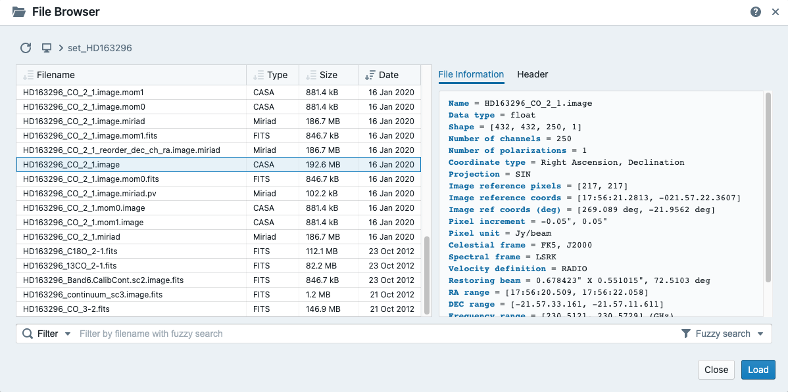
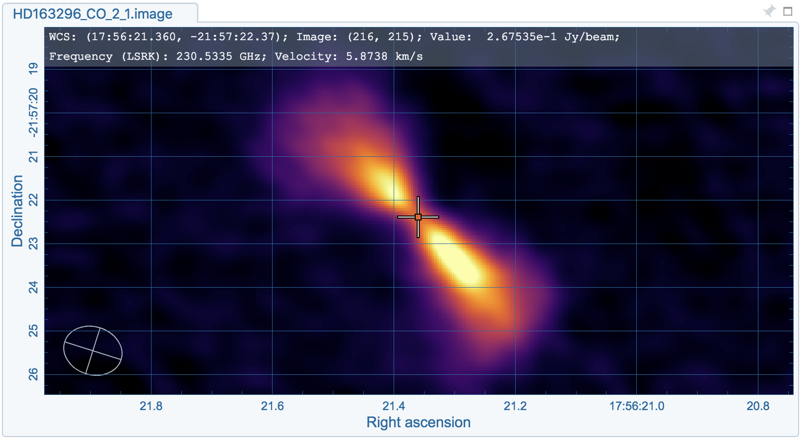
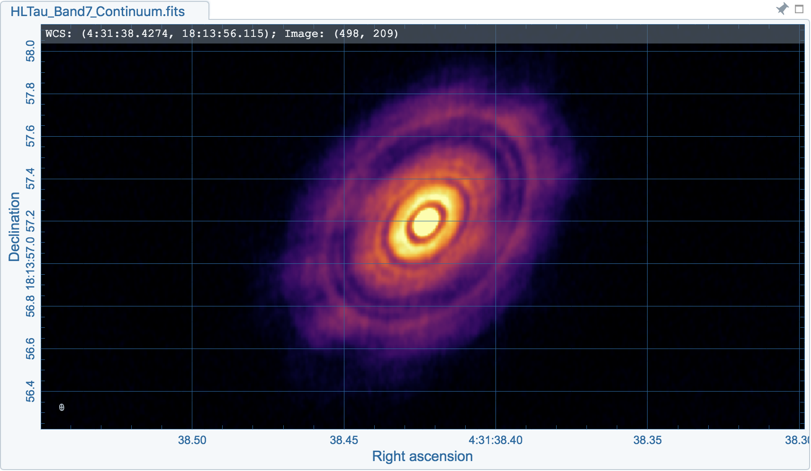
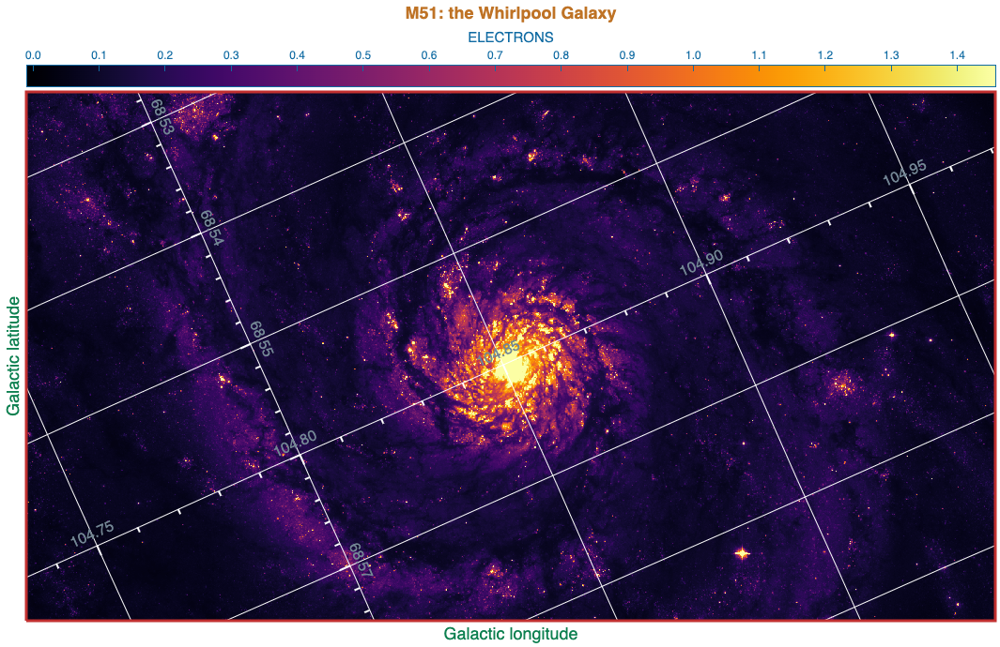
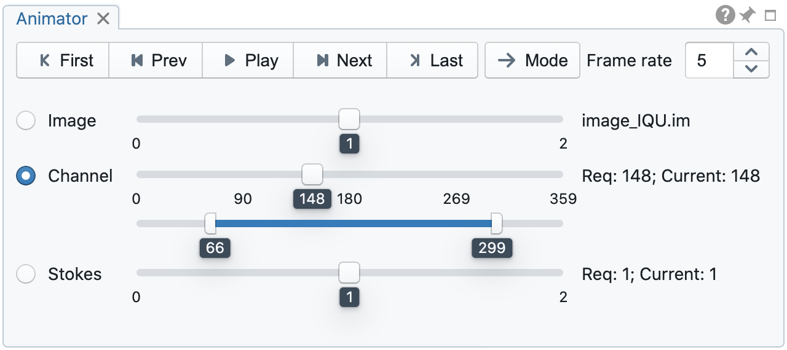
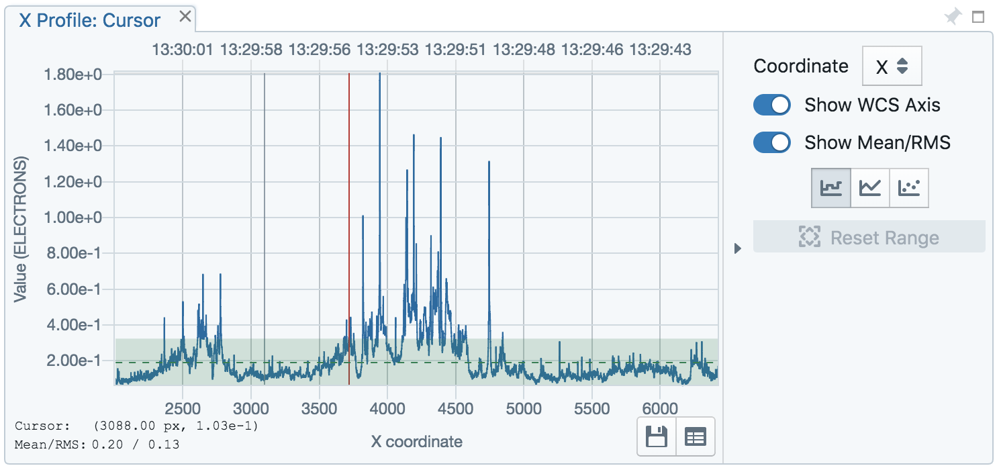
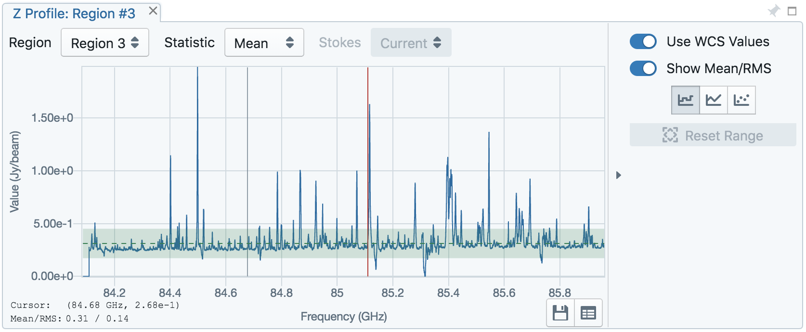

Functionalities
===============
With version 1.0, CARTA provides basic image viewing capabilities, basic profile viewing capabilities in both spatial and spectral domains, and basic per-frame or per-cube histogram viewing capabilities. Exporting images or charts in png format and charts in plain text format are supported.

File browser
------------
File browser, accessible via the menu **File** -> **Open image** or the menu **File** -> **Append image**, provides information of images supported by CARTA. Currently CARTA supports images in:  

* CASA format
* HDF5-SKA format
* FITS format
* MIRIAD format 

Only these formats will be shown in the file list with image type and file size. When an image is selected, a brief summary of image properties is provided on the right side of the dialog. Full header is also available in the second tab. To view an image, click the **Load** button at the bottom-right corner. To view a new image with all the loaded images closed, use **File** -> **Open image** -> **Load**. To view multiple images, use **File** -> **Append image** -> **Append**.

.. note::
   When viewing images in appending mode, alignments in the world coordinate system (WCS) and the frequency/velocity space are not available in this version. This feature is expected in v1.2.

.. warning::
   When the file information of an image cube with a *per-plane-beam* is requested, CARTA will spend a significant amount of time to calculate the beam information. This also applies when opening images with a per-plane-beam. This is a known issue and the developement team will try to solve it as soon as possible.

Image viewer
------------
When an image is loaded via the file browser, it is shown in the image viewer with its per-frame histogram shown in the render configuration widget. Currently CARTA supports raster image only. 

.. note::
   Contour rendering will be available in v1.2.

The aspect ratio of the image view is determined by the panel geometry. When the image viewer panel is resized, a tip with a ratio in screen pixel will be displayed.

Image resolutions and screen resolutions
^^^^^^^^^^^^^^^^^^^^^^^^^^^^^^^^^^^^^^^^
In CARTA, the resolution of an image displayed in the image viewer is *dynamically* determined by the screen resolution. For example, if an image with 10000 x 10000 pixels is loaded with the image viewer having a screen resolution of 500 x 500 pixels, a down-sampled image with a resolution of 500 x 500 pixels (a down-sample factor of 20) will be generated first, then displayed on screen with GPU accelerations. As users zoom in the images, new down-sample factors will be recomputed at every sampled zoom level. Effectively, users will see that the image becomes sharper and sharper at higher and higher zoom levels. No down-sampling is applied until the image resolution in the view is lower than the screen resolution. 

.. raw:: html

   <video width="640" controls loop>
     <source src="_static/carta_fn_imageViewer_downsample.mp4" type="video/mp4">
   </video>

.. warning::
   To make remote visualization of large images possible and efficient, CARTA adopts the above mentioned downsampling approach together with an efficient image compression algorithm. At rare circumstance, artifects may be seen on the images. A known issue is viewing an image with all pixels as zeros but one with a very high value. At low or default zoom level, some artifects will be observed around that pixel. At higher zoom levels, the artifects should dispear. CARTA has been tuned to localize the artifects within few screen pixels in order to minimize the impact of scientific analysis on such special cases. Should this become a problem in any kinds of analysis of yours, please contact `carta_helpdesk`_ for help.

   .. _carta_helpdesk: carta_helpdesk@asiaa.sinica.edu.tw

Render configuration of a raster image
^^^^^^^^^^^^^^^^^^^^^^^^^^^^^^^^^^^^^^
The render configuration widget controls how a raster image is rendered in the image viewer. On the top, there is a row of buttons with different clip levels plus a custom button. Below there is a plot showing the per-frame histogram (logarithmic scale) with a bin count equals to the geometic mean of the image size (x and y). The two vertical red bars indicate the two boundary values of a colormap. Interaction with a chart, like the histogram, is demostracted in the section :ref:`mouse_interaction_with_charts`. On the right, there is a column of options, such as scaling function, color map, boundary values, and control paramter of a scaling function (if applicable). Extra options to configure the histogram plot are hidden in the tool box on the right border. The histogram can be exported as a png image or a text file in tsv format.

.. raw:: html

   <video width="640" controls loop>
     <source src="_static/carta_fn_renderConfig_widget.mp4" type="video/mp4">
   </video>

By default, CARTA determines the boundary values of a colormap on **per-frame** basis. That is, a default "99.9%" clip level is applied to the per-frame histogram to look for the two boundary values. Then apply the values in "linear" scale to the default colormap "inferno" to render a raster image. This helps to inspect an image in detail without suffering from improper image rendering in most of cases. Below is an example of this per-frame rendering approach.

.. raw:: html

   <video width="640" controls loop>
     <source src="_static/carta_fn_renderConfig_perFrame.mp4" type="video/mp4">
   </video>

However, when comparing images frame by frame, color scales need to be fixed. This can be easily achieved by dragging the two vertical red bars, or typing in the values. When this happends, the "custom" button is enabled automatically and *all* frames will be rendered with the fixed boundary values. By clicking one of the clip buttons, CARTA switches back to the per-frame rendering mode. Below is an example of custom rendering. 

.. raw:: html

   <video width="640" controls loop>
     <source src="_static/carta_fn_renderConfig_perCustom.mp4" type="video/mp4">
   </video>

CARTA provides a set of scaling functions, such as:

* linear: :math:`y = x`
* log: :math:`y = {\log}_{\alpha}({\alpha}x+1)`
* square root: :math:`y = {\sqrt{x}}`
* squared: :math:`y = x^2`
* gamma: :math:`y = x^{\gamma}`
* power: :math:`y = ({\alpha}x-1)/{\alpha}`

A set of colormaps adopted from `matplotlib <https://matplotlib.org/tutorials/colors/colormaps.html?highlight=colormap>`_ is provided in CARTA.

CARTA image viewing performance
^^^^^^^^^^^^^^^^^^^^^^^^^^^^^^^
The per-frame rendering approach helps to improve the performance of loading an image significantly. Traditionally when an image is loaded, the minimum and maximum of the entire image (cube) are looked for. This becomes a serious performance issue if the image (cube) size is extraordinary large (> several GB). In addition, applying the global minimum and maximum to render a raster image usually (if not often) results in a poorly rendered image if the dynamical range is high. Then users need to re-render the image repeatly with refined boundary values. Re-rendering such a large image repeatly further deduces user experiences.

CARTA hopes to improve the image viewing experience by adopting GPU rendering with web browser technology. In addtion, CARTA only renders an image with just enough image resolution (down-sampling). This combination results in a high-performance remote image viewer. The total file size is no longer a bottleneck. The determinitve factors are  1) image size in x and y dimensions, and 2) internet bandwidth, instead.

Changing image view
^^^^^^^^^^^^^^^^^^^
CARTA provides different ways to change the image view. With a mouse, image zoom or pan actions are achieved by scrolling up/down or clicking, respectively, as demostrated in the section :ref:`mouse_interaction_with_images`. Alternatively, the image view can be changed to fit the image width or the image height, or to fit the screen resolution (i.e., screen resolution equals full image resolution), by using the buttons at the bottom-right corner of the image viewer. To change to different frames, channels, or stokes, please refer to the section :ref:`animator_intro`.

.. raw:: html

   <video width="640" controls loop>
     <source src="_static/carta_fn_imageViewer_changeView.mp4" type="video/mp4">
   </video>

When an image is zoomed in or out, the precison of the coordinate tick values is dynamically adjusted based on the zoom level. This feature allows users to analyze images with very differnet scales (WCS group; v1.2).

Cursor information
^^^^^^^^^^^^^^^^^^
When the cursor is on the image viewer, pixel information at the cursor position is shown at the top side of the image. The information includes:

* World coordinate of the current coordinate system. 
* Image coordinate in pixel.
* Pixel value.
* Down-sample factor (if applicable).
* Frequency, velocity, and reference frame (if applicable).

When the coordinate system is changed (e.g., ICRS to Galactic), the displayed world coordinate will be changed accordingly. The precison is determined dynamically based on the image header. 

The reference image coordinate (0,0) locates at the center of the bottom-left pixel of the image. Regardless the displayed image is down-sampled or not, the image coordinate always refers to full resolution image.

When cursor is moving, the pixel value adopted from the down-sampled image is displayed. When the cursor stops moving by 200 ms, the pixel value will be updated to the pixel value at full image resolution. 

If image header provides sufficient information in the frequency/velocity domain, the frequency and velocity with the reference frame of the current channel will be shown.

Configuring an image plot
^^^^^^^^^^^^^^^^^^^^^^^^^
CARTA provides flexible options to configure the appearance of an image plot. The overlay settings are accessible via **View** -> **Overlay** -> **Customize**.

.. raw:: html

   <video width="480" controls loop>
     <source src="_static/carta_fn_astOptions.mp4" type="video/mp4">
   </video>

As an example, below is an image with default overlay settings.

And, this is a customized one. The coordinate system has been switched from FK5 to Galactic. Font type, size, and color are customized, as well as the axis border and grid lines. 

The restoring beam is shown at the bottom-left corner, if applicable.

The image can be exported as a png image by clicking the "Export image" button at the bottom-right corner of the image viewer, or by **File** -> **Export image**.

.. _animator_intro:

Animator
--------
The animator widget provides controls of image frames, channels, and stokes. When multiple images are loaded via **File** -> **Append image**, "Frame" slide bar will show up and allows users to switch between different loaded images. If an image file has multiple channels or stokes, "Channel" or "Stokes" slide bars will appear. On the top there is a set of animation control buttons such play, stop, next, etc. The action will be applied to the slide bar with the activated radio button. As an example below, the action will be applied to the *channel* axis of the second stokes axis of the third image file. 

The frame rate spin box controls the *desired* frame per second (fps). The *actual* frame rate depends on image size and internet condition. The "Req" index will display the requested frame index, while the "Current" index will display the actually displayed index in the image viewer. When the "play" button is triggered, the "Req" index will keep the number of the delayed frames to be comparable to the desired fps, if the image is large and/or the internet condition is poor.

.. raw:: html

   <video width="640" controls loop>
     <source src="_static/carta_fn_animator_delayedFrame.mp4" type="video/mp4">
   </video>

.. note::
   More animator features, such as playback modes (backward, bouncing), playback range and step, etc. will be available in future releases.   

Spatial profiler
----------------
Spatial profiler provides the spatial profiles of the current image at the cursor position. When the cursor is moving on the image, instant profiles dervied from the (down-sampled) raster image are displayed. When the cursor stops moving for more than 200 ms, profiles derived from the full resolution image will be displayed instead. This allows users to inspect the image in an efficient way. The "F" key will disable and enable profile update. A marker "+" will be placed on the image to indicate the position of the profiles taken. 

.. raw:: html

   <video width="640" controls loop>
     <source src="_static/carta_fn_spatialProfiler_demo.mp4" type="video/mp4">
   </video>

The interactions of the spatial profiler widget are demostracted in the section :ref:`mouse_interaction_with_charts`. The red vertical bar indicates the pixel where the profile is taken. The bottom axis shows the image coordinate, while optional world coordinate is displayed on the top axis. Extra options to configure the profile plot are available to the right border. The option "Show Mean/RMS" will adopt the data in the current view to derive a mean value and an rms value, and visualize the results on the plot. The profile can be exported as a png image or a text file in tsv format via the buttons at the bottom-right corner.

.. note::
   More flexibilities on how mean and rms values are derived will be provided in future releases. Profile fitting capability will be available in future release.   

Spectral profiler
-----------------
Spectral profiler provides the spectral profile of the current image cube at the cursor position. When the cursor stops moving for more than 200 ms, a spectral profile derived at the cursor position from the full resolution image cube will be displayed. The "F" key will disable and enable profile update. A marker "+" will be placed on the image to indicate the position of the profiles taken. 

.. raw:: html

   <video width="640" controls loop>
     <source src="_static/carta_fn_spectralProfiler_demo.mp4" type="video/mp4">
   </video>

The interactions of the spectral profiler widget are demostracted in the section :ref:`mouse_interaction_with_charts`. The red vertical bar indicates the channel of the image displayed in the image viewer. The bottom axis shows the spectral coordinate, while optional channel coordinate can be displayed instead. Extra options to configure the profile plot are available to the right border. The option "Show Mean/RMS" will adopt the data in the current view to derive a mean value and an rms value, and visualize the results on the plot. The profile can be exported as a png image or a text file in tsv format via the buttons at the bottom-right corner.

.. note::
   Approximated spectral profile while cursor is moving (like spatial profiler) will be provided in future releases. More flexibilities on how mean and rms values are derived will be provided in future releases. Profile fitting capability will be available in future release.
   